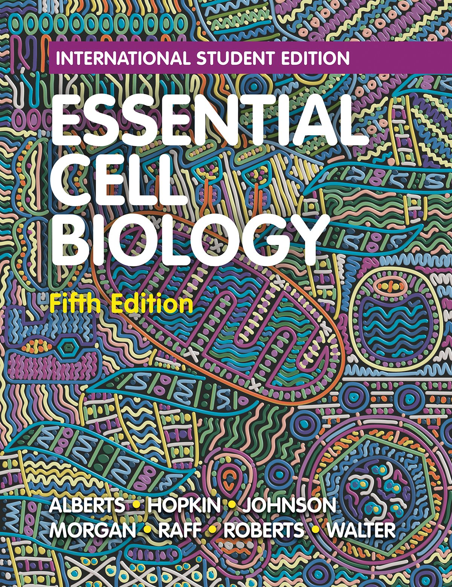
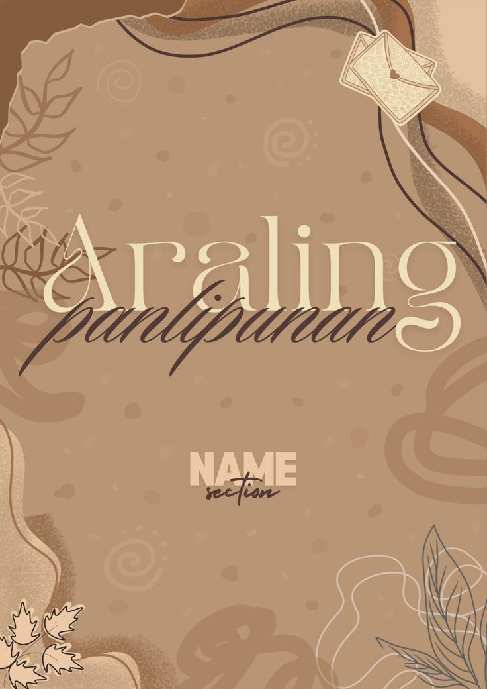

<!DOCTYPE html>
<html lang="en">
<head>
<meta charset="utf-8" />
<meta name="viewport" content="width=device-width,initial-scale=1" />
<title>COLLEGE OF ARTS AND SCIENCES OF ASIA AND THE PACIFIC E-LIBRO</title>-
<!-- Simple, self-contained styles -->

</head>

<body>
  

    <header class="top" aria-label="CASAP E-LIBRO header">
      <!-- swap the placeholder logo with your real logo: images/casap-logo.png -->
      
      

        <h1>CASAP E-LIBRO</h1>
        
Center for Academic Support and Program — Student Resources

      

    </header>

    <!-- Controls: search + filters -->
    

      

        <svg width="18" height="18" viewBox="0 0 24 24" fill="none" style="opacity:.6">
          <path d="M21 21l-4.35-4.35" stroke="currentColor" stroke-width="2" stroke-linecap="round" stroke-linejoin="round"/>
          <path d="M11 19a8 8 0 1 1 0-16 8 8 0 0 1 0 16z" stroke="currentColor" stroke-width="2" stroke-linecap="round" stroke-linejoin="round"/>
        </svg>
        <input id="search" type="search" placeholder="Search by title or author..." aria-label="Search books">
      

      

        <select id="subjectFilter" aria-label="Filter by subject">
          <option value="all">All subjects</option>
          <option value="English">English</option>
          <option value="Mathematics">Mathematics</option>
          <option value="Science">Science</option>
          <option value="ICT">ICT / Computer</option>
          <option value="History">History</option>
          <option value="Filipino">Filipino</option>
        </select>

        <button id="resetBtn" title="Reset filters">Reset</button>
      

    

    <!-- Subjects quick chips -->
    <nav class="subjects" aria-label="Subjects">
      
All

      
English

      
Mathematics

      
Science

      
ICT

      
History

      
Filipino

    </nav>

    <!-- Book grid -->
    <section class="grid" id="grid" aria-label="Book list">
      <!-- Sample cards. Replace hrefs with your PDFs at books/<filename>.pdf and covers in images/ -->
      <!-- Card 1 -->
      <article class="card" data-title="Englsh Grammar Basics" data-author="John Adams" data-subject="English" tabindex="0">
        
        

          <h3>English Grammar Basics</h3>
          
John Adams · English

          

            <button class="info" data-file="English-grammar.pdf" data-cover="img2-jpg.webp" data-title="English Grammar Basics" data-author="John Adams" data-desc="A concise guide to English grammar for learners.">Info</button>
            <a class="download" href="English-grammar.pdf" download>Download</a>
          

        

      </article>

      <!-- Card 2 -->
      <article class="card" data-title="Literature Classics" data-author="Emily Rose" data-subject="English" tabindex="0">
        
        

          <h3>Literature Classics</h3>
          
Emily Rose · English

          

            <button class="info" data-file="Literature.pdf" data-cover="img-3.jpg" data-title="Literature Classics" data-author="Emily Rose" data-desc="Selected classic literature pieces for study.">Info</button>
            <a class="download" href="Literature.pdf" download>Download</a>
          

        

      </article>

      <!-- Card 3 -->
      <article class="card" data-title="General Mathematics" data-author="Dr. Smith" data-subject="Mathematics" tabindex="0">
        
        

          <h3>General Mathematics</h3>
          
Dr. Smith · Mathematics

          

            <button class="info" data-file="intro-math.pdf" data-cover="gen-math.jpg" data-title="General Mathematics" data-author="Dr. Smith" data-desc="Complete guide covering basic to intermediate math topics.">Info</button>
            <a class="download" href="intro-math.pdf" download>Download</a>
          

        

      </article>

      <!-- Card 4 -->
      <article class="card" data-title="Algebra & Geometry" data-author="R. Gomez" data-subject="Mathematics" tabindex="0">
        
        

          <h3>Algebra & Geometry</h3>
          
R. Gomez · Mathematics

          

            <button class="info" data-file="algebra_and_geometry.pdf" data-cover="img-algebra-geo.jpg" data-title="Algebra & Geometry" data-author="R. Gomez" data-desc="Practice problems and theory for algebra and geometry.">Info</button>
            <a class="download" href="algebra_and_geometry.pdf" download>Download</a>
          

        

      </article>

      <!-- Card 5 -->
      <article class="card" data-title="Earth Science" data-author="L. Martin" data-subject="Science" tabindex="0">
        
        

          <h3>Earth Science</h3>
          
L. Martin · Science

          

            <button class="info" data-file="Earth-Science.pdf" data-cover="earth-science.jpg" data-title="Earth Science" data-author="L. Martin" data-desc="Introductory earth science textbook with diagrams and exercises.">Info</button>
            <a class="download" href="Earth-Science.pdf" download>Download</a>
          

        

      </article>

      <!-- Card 6 -->
      <article class="card" data-title="Biology Essentials" data-author="Dr. Carlos" data-subject="Science" tabindex="0">
        
        

          <h3>Biology Essentials</h3>
          
Dr. Carlos · Science

          

            <button class="info" data-file="biology-student-textbook-grade-9_part-1.pdf" data-cover="https://via.placeholder.com/640x960.png?text=Biology+Essentials" data-title="Biology Essentials" data-author="Dr. Carlos" data-desc="Core biology topics for senior high students.">Info</button>
            <a class="download" href="biology-student-textbook-grade-9_part-1.pdf" download>Download</a>
          

        

      </article>

      <!-- Card 7 -->
      <article class="card" data-title="Intro to Computing" data-author="E. Santos" data-subject="ICT" tabindex="0">
        
        

          <h3>Intro to Computing</h3>
          
E. Santos · ICT

          

            <button class="info" data-file="An_Introduction_to_Computing.PDF" data-cover="computing.jpg" data-title="Intro to Computing" data-author="E. Santos" data-desc="Fundamentals of computing and digital literacy.">Info</button>
            <a class="download" href="An_Introduction_to_Computing.PDF" download>Download</a>
          

        

      </article>

      <!-- Card 8 -->
      <article class="card" data-title="Web Development Basics" data-author="A. Torres" data-subject="ICT" tabindex="0">
        
        

          <h3>Web Development Basics</h3>
          
A. Torres · ICT

          

            <button class="info" data-file="WebDevelopmentBasics.pdf" data-cover="web-develop.jpg" data-title="Web Development Basics" data-author="A. Torres" data-desc="HTML, CSS, and simple JavaScript projects for beginners.">Info</button>
            <a class="download" href="WebDevelopmentBasics.pdf" download>Download</a>
          

        

      </article>

      <!-- Card 9 -->
      <article class="card" data-title="Philippine History" data-author="M. Santos" data-subject="History" tabindex="0">
        
        

          <h3>Philippine History</h3>
          
M. Santos · History

          

            <button class="info" data-file="Philippine-History.pdf" data-cover="history-phil.jpg" data-title="Philippine History" data-author="M. Santos" data-desc="Overview of major events in Philippine history.">Info</button>
            <a class="download" href="Philippine-History.pdf" download>Download</a>
          

        

      </article>

      <!-- Card 10 -->
      <article class="card" data-title="Araling Panlipunan" data-author="R. dela Cruz" data-subject="Filipino" tabindex="0">
        
        

          <h3>Araling Panlipunan</h3>
          
R. dela Cruz · Filipino

          

            <button class="info" data-file="Araling_Panlipunan_Social_Studies_in_the_Philippines.pdf" data-cover="araling-panlipunan.jpg" data-title="Araling Panlipunan" data-author="R. dela Cruz" data-desc="Social studies material for junior high.">Info</button>
            <a class="download" href="Araling_Panlipunan_Social_Studies_in_the_Philippines.pdf" download>Download</a>
          

        

      </article>

    </section>
    <footer>
      &copy; 2025 CASAP E-LIBRO. All rights reserved.
    </footer>
  

  <!-- modal -->
  

    

      
      

        <h2 id="mdTitle">Title</h2>
        
Author

        
Description

        

          <a id="mdDownload" class="download" href="#" download>Download PDF</a>
          <button id="mdClose" class="info">Close</button>
        

      

    

  

<!-- JavaScript: filter, search, modal -->

</body>
</html>
